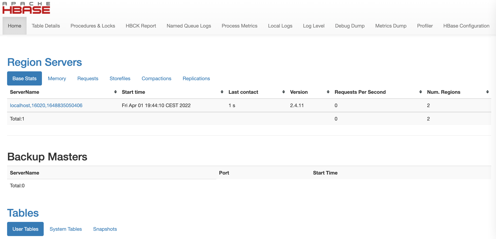
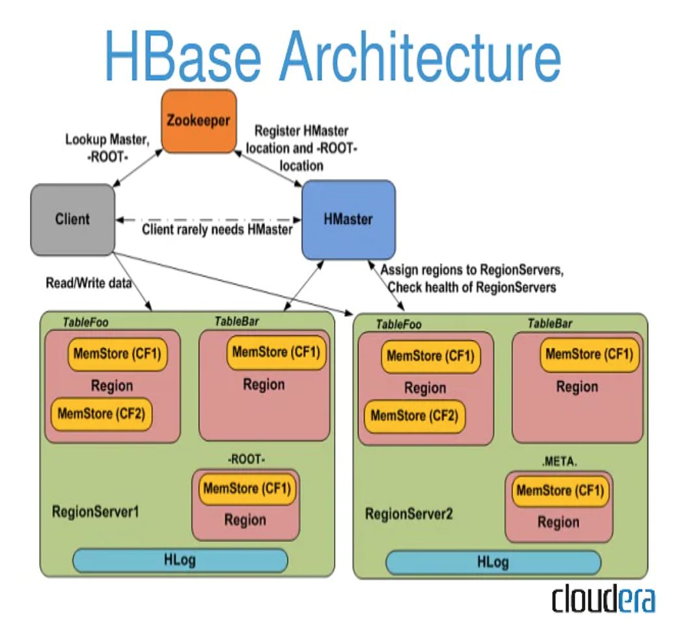
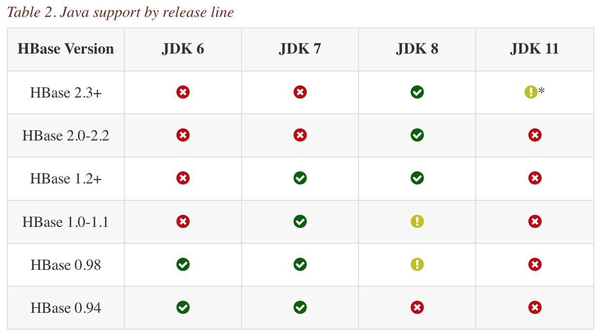
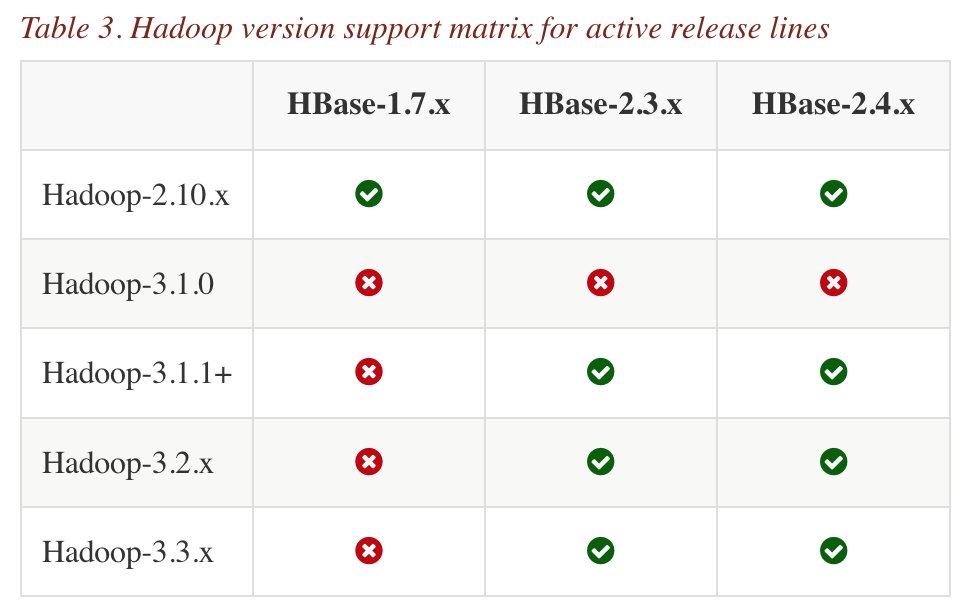

# HBase

## Installation

### Standalone

1. Download the HBase binary from [this link](https://hbase.apache.org/):

```bash
tar -xvzf hbase-2.4.11-bin.tar.gz
sudo mv hbase-2.4.11 /usr/local/hbase
```

2. Update `.bashrc`:
```bash
export HBASE_HOME=/usr/local/hbase
export PATH=$PATH:$HBASE_HOME/bin
```

3. Start the Hbase:
```bash
start-hbase.sh
```

4. Go to http://localhost:16010 to check its status:
<p float="left">
	
</p>

5. Start the `HBase shell`:
```bash
hbase shell
```

6. Create a table and access it:
```bash
hbase> create 'mytable', 'cf'
hbase> list
TABLE
mytable
1 row(s)
Took 0.0244 seconds
=> ["mytable"]

hbase> put 'mytable', 'first', 'cf:message', 'hello HBase'
hbase> put 'mytable', 'second', 'cf:foo', 0x0
hbase> put 'mytable', 'third', 'cf:bar', 3.14

hbase> get 'mytable', 'first'
COLUMN                                         CELL
 cf:message                                    timestamp=2022-04-01T20:07:49.762, value=hello HBase
1 row(s)
Took 0.0407 seconds

hbase> scan 'mytable'
ROW                                            COLUMN+CELL
 first                                         column=cf:message, timestamp=2022-04-01T20:07:49.762, value=hello HBase
 second                                        column=cf:foo, timestamp=2022-04-01T20:08:36.932, value=0
 third                                         column=cf:bar, timestamp=2022-04-01T20:08:59.407, value=3.14
3 row(s)
Took 0.0200 seconds
```

## Benchmarking

1. For 10 million rows, `join_by_spark` takes 48.58 seconds:
```bash
spark-submit --master local[*] join_by_spark.py
```

2. For 10 million rows, `join_by_sql` takes 2.90 seconds:
```bash
python join_by_sql.py
```

## HBase run modes

<p float="left">
	
</p>

* In `standalone` mode, HBase does not use `HDFS` -- it uses the local filesystem instead -- and it runs all HBase daemons and a `local ZooKeeper` all up in the same JVM. Zookeeper binds to a well known port `2181` so clients may talk to HBase.

* Distributed mode can be subdivided into distributed but all daemons run on a single node -- a.k.a `pseudo-distributed` -- and `fully-distributed` where the daemons are spread across all nodes in the cluster. Distributed modes require an instance of the Hadoop Distributed File System (`HDFS`).

* A pseudo-distributed mode is simply a distributed mode run on a single host. Use this configuration testing and prototyping on HBase. Do not use this configuration for production nor for evaluating HBase performance. 

The configuration of the `standalone` mode is in [hbase-site.xml](conf/hbase-site.xml) and [hbase-env.sh](conf/hbase-env.sh), which need to be put in the `$HBASE_HOME/conf` folder.

<p float="left">
	
	
</p>

## References
* https://www.kaggle.com/datasets/rounakbanik/the-movies-dataset
* https://towardsdatascience.com/guide-to-big-data-joins-python-sql-pandas-spark-dask-51b7f4fec810
* https://docs.cloudera.com/cdp-private-cloud-base/7.1.6/managing-hbase/topics/hbase-example-using-hbase-spark-connector.html
* http://svn.apache.org/repos/asf/hbase/hbase.apache.org/trunk/0.94/book/standalone_dist.html
* https://docs.cloudera.com/HDPDocuments/Ambari-2.7.5.0/managing-high-availability/content/amb_start_and_test_your_hbase_cluster.html
* https://docs.cloudera.com/runtime/7.2.10/accessing-hbase/topics/hbase-use-commandline-utilities.html
* https://hbase.apache.org/book.html#basic.prerequisites
* https://askubuntu.com/questions/493590/hbase-master-not-running-in-pseudo-distributed-mode
